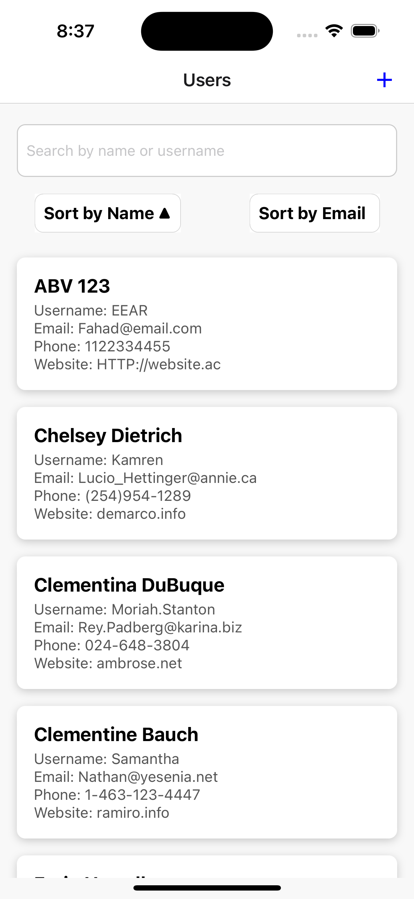

# Users CRUD | JSONPlaceholder API  👋

This is an [Expo](https://expo.dev) project

## Get started

1. Install dependencies

   ```bash
   npm install
   ```

2. Start the app

   ```bash
    npx expo start
   ```

## Overview
 This project is a React Native application built with Expo. It has CRUD operations, sorting, and searching functionalities.



## Features
- CRUD Operations
- Sorting: By Name or Email with Asc. and Dsc.
- Searching
- State Management: Uses react TanStack Query.
- API Integration: Uses Axios.
- Form Validation: React hook forms.

## Known Limitations
### Local creating, updating, & deleting
Because JSONPlaceholder is a simulated API intended for testing and prototyping, any alterations (such as creating, updating, or deleting) made to the data are not saved on the server side but managed locally.
